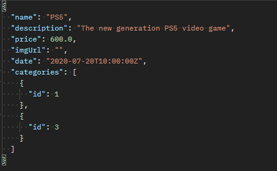

# DS.CATLOG API SYSTEM

## SOBRE:

**DS.CATALOG** é um projeto Back-end realizado com a tecnologia Java **version 17** e **framework Spring Boot version 3.1.1** utilizando o padrão de arquitetura em camadas.
O projeto trata-se de uma API Rest e-commerce de Produtos, onde está sendo disponibilizados funcionalidades, validações e tratamentos de exceções conforme abordado abaixo:

**OPERAÇÕES DE CRUD:**

    - Busca paginada de recursos
    - Busca de recurso por id
    - Inserir novo recurso
    - Atualizar recurso
    - Deletar recurso

**TESTES AUTOMATIZADOS:**

    - Teste unitários com JUnit
    - Testes de repository
    - Inserir novo recurso
    - Testes de unidade com Mockito
    - Testes da camada web com MockMvc
    - Testes de integração

**VALIDAÇÃO E SEGURANÇA:**

    - Validação com Bean Validation
      . Annotations
      . Customizando a resposta HTTP
      . Validações personalizadas com acesso a banco

    - Autenticação e autorização
       . Spring Security
       . OAuth 2.0
       . Token JWT
       . Autorização de rotas por perfil

## COMO EXECUTAR:

### Back end
Pré-requisitos: Java 17, Postman, Git

**-> Seguir Passo a passo abaixo**

```bash
## clonar repositório
git clone https://github.com/MedeirosGiana/dscatalog-springboot-project.git

## importar na sua IDE de preferencia

## executar o projeto
./mvnw spring-boot:run
```

1. Utilizar a interface do Postman para testar os endpoints.
2. Informar as rotas dos endpoints conforme exemplos abaixo:

- Product By Pagead - GET
```
http://localhost:8080/products?page=0&linesPerPage=5&direction=ASC&orderBy=name
```
- Product By Id - GET
```
http://localhost:8080/products/1
```
- Insert Product - POST
```
http://localhost:8080/products?page=0&linesPerPage=5&direction=ASC&orderBy=name
```
-> Dados JSON para teste **Insert**


- Update Product - PUT
```
http://localhost:8080/products/1
```
-> Os mesmo dados de teste utilizados para Insert, podem ser utilizados para Update

- Delete Product - DELETE
```
http://localhost:8080/products/1
```

## TESCNOLOGIAS UTILIZADAS:

- Java
- Spring Boot
- JPA
- Maven
- H2 Database
- PostgresSQL
- Spring Security
- JUnit
- JWT Auth
- Postman

### Autora
Giana Medeiros
- https://www.linkedin.com/in/gianamedeiros/

### Plataforma de estudo

- https://devsuperior.com.br/cursos